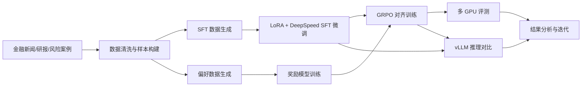

# SFT_RLHF

金融领域大模型微调与优化项目代码仓库，覆盖监督微调（SFT）、奖励模型训练（RM）、基于 GRPO 的对齐训练、模型评测、推理对比与部署脚本，目标是构建面向金融分析场景的产品级 AI 助手。

> 面向金融分析助手场景的大模型训练工程实践，包含数据构建、SFT、奖励模型、GRPO 对齐、评测与部署的完整闭环。

## 项目亮点

- 金融垂直场景两阶段优化：`SFT -> RM -> GRPO`
- 覆盖数据构建、训练、评测、推理对比与部署完整流程
- 支持 `LoRA + DeepSpeed` 的高效分布式训练
- 支持基于奖励模型的多 GPU 评测与效果对比
- 提供 `vLLM` 推理服务与远程 GPU 部署脚本

## 项目背景

该项目面向 AI 金融分析助手场景展开，重点解决通用开源模型在金融领域中的几个典型问题：

- 财经术语识别不够准确
- 对突发事件的分析链路不完整
- 风险提示能力不足，难以贴近投资场景
- 输出风格不稳定，存在合规表达风险

项目整体采用两阶段优化路线：

1. 通过金融数据构建与 SFT 微调增强模型领域理解能力
2. 通过奖励模型与 GRPO 对齐优化回答的客观性、中立性、可读性与安全边界

## 训练链路



## 项目链路

本仓库主要覆盖以下训练与评测流程：

1. 金融数据处理与样本构建
2. SFT 数据生成与 LoRA 微调
3. 偏好数据生成与奖励模型训练
4. 基于奖励模型的 GRPO 对齐训练
5. 多 GPU 评测与推理效果对比
6. 远程服务器部署与推理服务启动

## 适用场景

该项目更适合作为以下方向的工程实践参考：

- 金融垂直大模型微调
- 奖励模型与偏好对齐训练
- 基于 LoRA 的轻量化训练方案
- DeepSpeed 多机多卡训练与评测
- vLLM 推理对比与部署

## 目录结构

- `sft_data/`: SFT 数据生成脚本，包括单轮与多轮对话数据构建
- `sft_lora_script/`: 基于 LoRA + DeepSpeed 的 SFT 训练脚本，以及 vLLM 推理对比脚本
- `financial_reward_model/`: 奖励模型训练、验证与推理服务脚本
- `reward_model_data_script/`: 偏好数据生成、问题构造、答案生成与数据拆分脚本
- `grpo_financial_tuning/`: GRPO 训练、分布式评测、配置文件与远程部署脚本

## 仓库速览

| 模块 | 主要用途 |
| --- | --- |
| `sft_data/` | 构建金融 SFT 数据，生成单轮/多轮训练样本 |
| `sft_lora_script/` | 执行 SFT 微调，并进行微调前后推理效果对比 |
| `reward_model_data_script/` | 生成问题、答案与偏好数据，构建奖励模型训练集 |
| `financial_reward_model/` | 训练奖励模型，并提供验证与推理服务脚本 |
| `grpo_financial_tuning/` | 基于奖励模型执行 GRPO 对齐训练与多 GPU 评测 |

## 主要技术栈

- Python
- PyTorch
- Transformers
- PEFT / LoRA
- TRL / GRPO
- DeepSpeed
- vLLM
- JSONL 数据管线
- Shell / Linux 多机训练脚本

## 运行前说明

### 1. API Key

依赖 DeepSeek API 的脚本已统一改为从环境变量读取密钥：

```bash
export DEEPSEEK_API_KEY="your-api-key"
```

### 2. 部署脚本参数

部署脚本中的远程服务器信息已改为环境变量传入：

```bash
export REMOTE_USER="ubuntu"
export REMOTE_HOST="your-server-host"
export REMOTE_PATH="/shared/grpo_financial_tuning/"
```

### 3. 训练环境

项目中的部分脚本默认面向多卡或远程 GPU 环境，运行前请根据本地或服务器实际资源调整：

- 模型路径
- 数据路径
- DeepSpeed 配置
- hostfile
- GPU 数量与端口配置

## 快速开始

### 1. 克隆仓库

```bash
git clone https://github.com/Egg-ops-rs/SFT_RLHF.git
cd SFT_RLHF
```

### 2. 配置环境变量

```bash
export DEEPSEEK_API_KEY="your-api-key"
```

如需运行远程部署脚本，可额外设置：

```bash
export REMOTE_USER="ubuntu"
export REMOTE_HOST="your-server-host"
export REMOTE_PATH="/shared/grpo_financial_tuning/"
```

### 3. 按模块阅读/运行

建议按以下顺序理解项目：

1. `sft_data/`：查看 SFT 数据如何生成
2. `sft_lora_script/`：查看 SFT 微调和推理对比
3. `reward_model_data_script/`：查看偏好数据生成过程
4. `financial_reward_model/`：查看奖励模型训练流程
5. `grpo_financial_tuning/`：查看 GRPO 对齐训练与评测

## 开源版本说明

由于安全与体积限制，当前公开版本做了以下处理：

- 移除了硬编码 API Key
- 移除了硬编码服务器地址
- 未上传 PDF 原始文档
- 未上传压缩包、原始大数据文件、训练产物、日志与检查点

因此，公开仓库更适合作为项目代码结构与训练流程展示版本，而非可直接一键复现实验的完整归档。

## 仓库简介文案

如果你要填写 GitHub 仓库简介，可直接使用下面这句：

> Financial-domain LLM fine-tuning project with SFT, reward model training, GRPO alignment, multi-GPU evaluation, and vLLM-based inference comparison.

## 建议阅读顺序

如果你希望基于此仓库继续复现训练流程，建议优先从以下模块开始阅读：

1. `sft_data/` 了解数据生成方式
2. `sft_lora_script/` 了解 SFT 微调流程
3. `financial_reward_model/` 与 `reward_model_data_script/` 了解奖励模型训练链路
4. `grpo_financial_tuning/` 了解 GRPO 对齐训练、评测与部署逻辑
